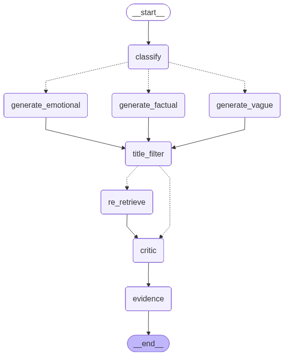
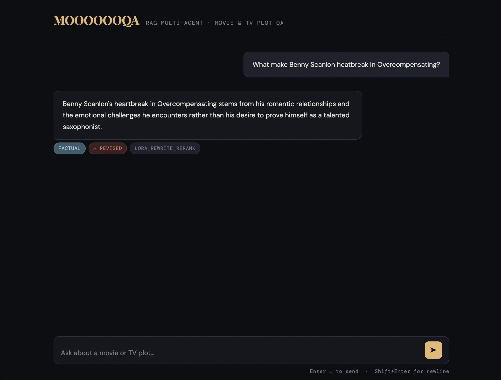

[](https://classroom.github.com/a/nyG_mTdu)

# MOOOOOOQA — Multi-Agent RAG Web App

A conversational web interface for the Movie & TV Plot QA multi-agent system built with Flask. The system uses a LangGraph-based agentic pipeline with a LoRA fine-tuned SmolLM2 model for factual question answering.

---

## Project Structure

```
stitching-project/
├── app.py                          ← Flask server + full pipeline
├── smollm2-lora-narrativeqa.pt     ← LoRA fine-tuned model weights
├── requirements.txt
├── .env                            ← API keys (do not commit)
├── templates/
│   └── index.html                  ← Single-page chat UI
├── data_prep/
│   ├── lora_finetuning_data_gen.   ← Data generation for lora finetunning (narrative qa) 
│   ├── movie_scrape.ipynb          ← Scrape movie plots from Wikipedia
│   ├── tv_show_scrape.ipynb        ← Scrape TV episode plots from Wikipedia
│   └── text_prep.ipynb             ← Clean, chunk, embed, upload to 
├── basic_rag.ipynb                 ← Basic RAG experiemnt notebook (integrated into agent.ipynb)
├── lora_finetunning.ipynb          ← LoRA fine-tuning on NarrativeQA
├── multiagent_lora.ipynb           ← Multi-agent pipeline notebook
├── multiagent_with_based.ipynb     ← Multi-agent with base LLM pipeline notebook
├── evaluation_report/
│   └── multiagent_summary.md       ← Evaluation report
└── README.md
```

---

## 1. Environment Setup

### 1a. Create and activate a virtual environment
```bash
python -m venv genai
source genai/bin/activate        # Mac/Linux
genai\Scripts\activate           # Windows
```

### 1b. Install dependencies
```bash
pip install -r requirements.txt
```

### 1c. Create a `.env` file in the project root
```
OPENAI_API_KEY=sk-...
PINECONE_API_KEY=pcsk_...
```

> ⚠️ Never commit your `.env` file or API keys to GitHub.

---

## 2. LLM Configuration

This project uses **GPT-4o-mini** via the OpenAI API for classification, title filtering, emotional/vague generation, and the critic agent. Set your key in `.env` as shown above.

The **LoRA fine-tuned SmolLM2-1.7B** model handles factual questions locally on CPU. No additional API key is required for this model.

---

## 3. Pinecone Configuration

This project uses a Pinecone vector store to retrieve plot chunks.

- **Index name:** `stream-embeddings`
- **Embedding model:** `sentence-transformers/all-mpnet-base-v2`
- **Text key:** `id`

Set your Pinecone API key in `.env`. If you are using a pre-built index, no further setup is needed. If building from scratch, follow the Data Preparation step below.

---

## 4. Data Preparation (Optional — only if building from scratch)

If you need to scrape and prepare data from scratch, run these notebooks in order from the `data_prep/` folder:

1. **`movie_scrape.ipynb`** — Scrapes movie plot summaries from Wikipedia
2. **`tv_show_scrape.ipynb`** — Scrapes TV episode plot summaries from Wikipedia
3. **`text_prep.ipynb`** — Cleans, chunks, merges, embeds, and uploads all chunks to Pinecone

After running these, a `chunk_data/merged_chunks.json` file will be generated in the project root. This file is required for the app to run.

> The dataset is not included in this repository. You must either run the data prep notebooks or obtain `merged_chunks.json` separately.

---

## 5. LoRA Fine-tuning (Optional — only if retraining the model)

The fine-tuned model weights (`smollm2-lora-narrativeqa.pt`) are already included in the project root. Skip this section unless you want to retrain.

### Dataset
The model was fine-tuned on **NarrativeQA** — a dataset of short, factual questions about movie and book plots.

Run **`lora_finetunning_data_gen.ipynb`** to get the data


### Fine-tuning
Open and run **`lora_finetunning.ipynb`**. The notebook:
1. Loads the base model `HuggingFaceTB/SmolLM2-1.7B-Instruct`
2. Applies LoRA adapters (`r=8`, `lora_alpha=16`, target modules: `q_proj`, `k_proj`, `v_proj`, `o_proj`)
3. Fine-tunes for 5 epochs on 900 training examples
4. Saves the weights to `smollm2-lora-narrativeqa.pt`

> Training requires a GPU. The notebook was run on a CUDA device. CPU training is possible but very slow.

---

## 6. Running the Web App with MOOOOOAQ

```bash
python app.py
```

Open **http://localhost:8080** in your browser.

On first query, the pipeline initializes — this loads the LoRA model, embeddings, and connects to Pinecone. Subsequent queries are faster as everything stays in memory.

---

## 7. How the Pipeline Works

| Stage | Agent | Model | What it does |
|---|---|---|---|
| 1 | **Classifier + Rewrite** | GPT-4o-mini | Labels the question as factual / emotional / vague and rewrites it as a HyDE query |
| 2 | **Retriever + Reranker** | Cross-Encoder | Fetches 10 candidates from Pinecone, re-scores with Cross-Encoder, keeps top 5 |
| 3 | **Generator (factual)** | LoRA SmolLM2-1.7B | Produces short, direct answers for factual questions |
| 4 | **Generator (emotional/vague)** | GPT-4o-mini | Produces longer, reasoning-based answers for emotional and vague questions |
| 5 | **Title Filter** | GPT-4o-mini | Resolves which show/movie the question targets; filters chunks; triggers re-retrieval if needed |
| 6 | **Critic** | GPT-4o-mini | Fact-checks the answer against evidence; rewrites if unsupported |
| 7 | **Evidence** | — | Selects top-3 chunks as source evidence for the user |

### Agent Workflow


---

## 8. API

`POST /api/query`
Body: `{ "query": "Your question here" }`

Response:
```json
{
  "answer": "...",
  "question_type": "factual|emotional|vague",
  "strategy": "lora_rewrite_rerank|rewrite_only|clarify_then_rerank",
  "generator_used": "lora|gpt",
  "evidence": [
    { "title": "Show Name", "id": "chunk_id", "snippet": "..." }
  ],
  "critic_judgment": {
    "supported": true,
    "explanation": "...",
    "revised_answer": "..."
  }
}
```

---

## 9. App Demo


